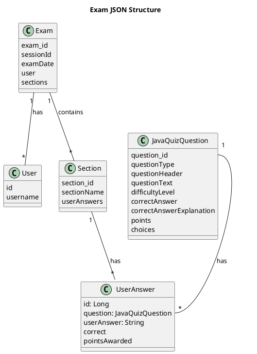
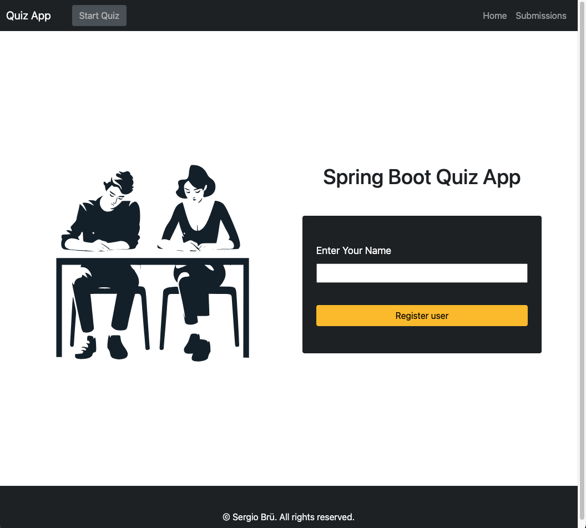
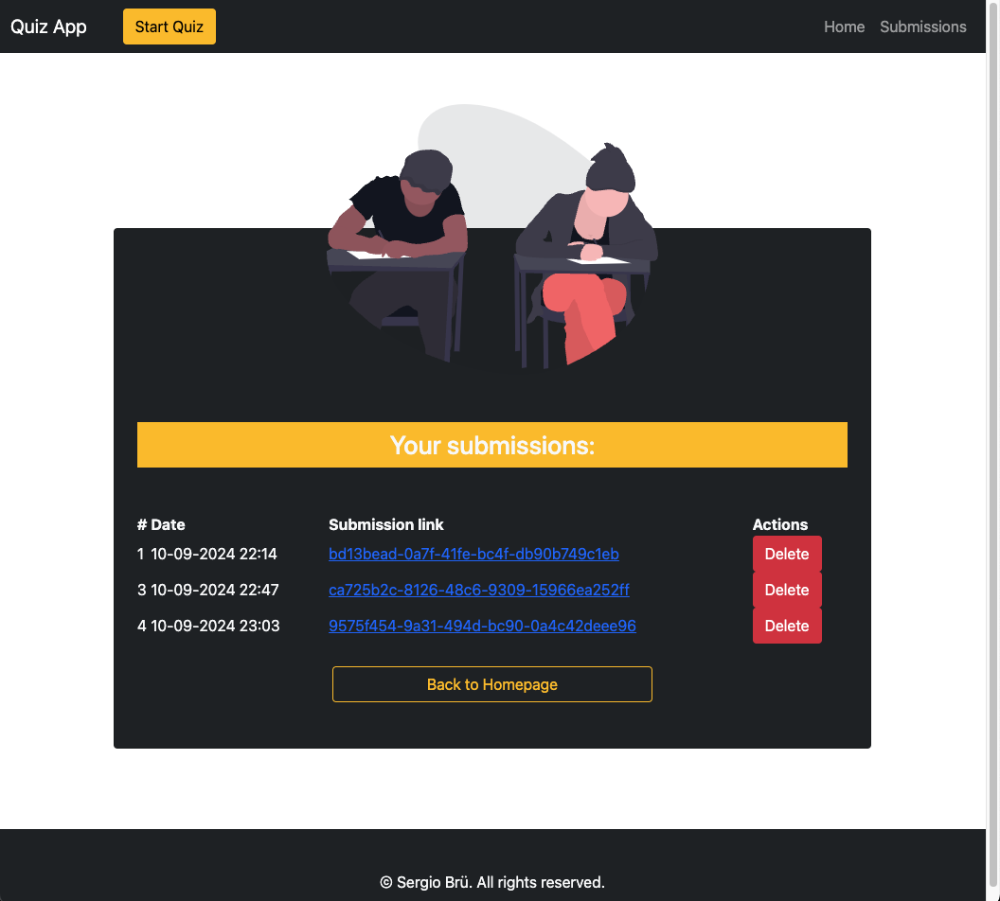
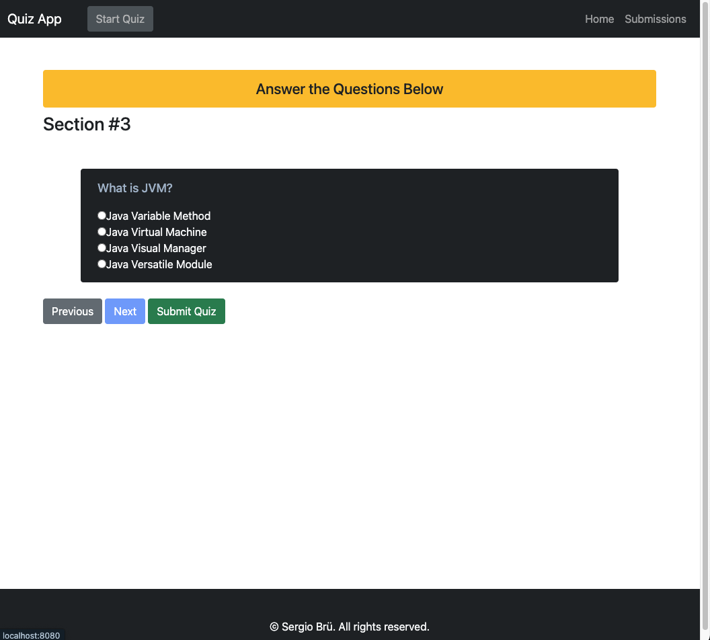
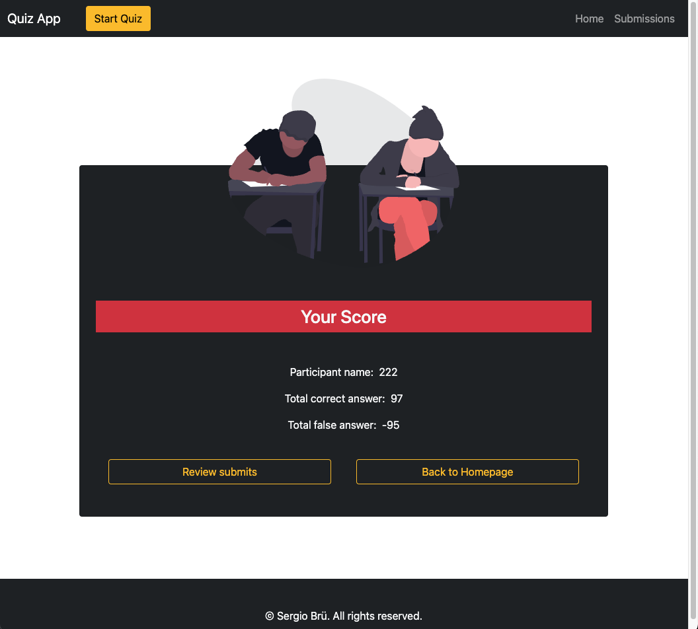
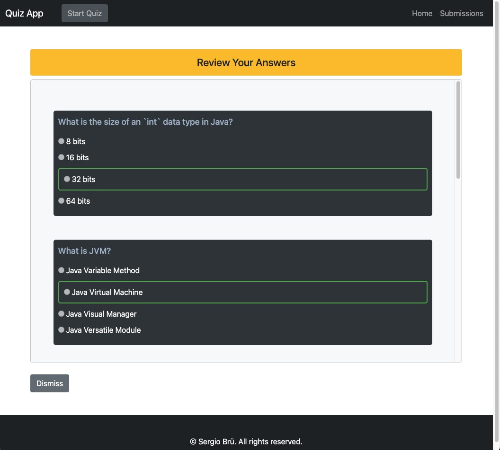
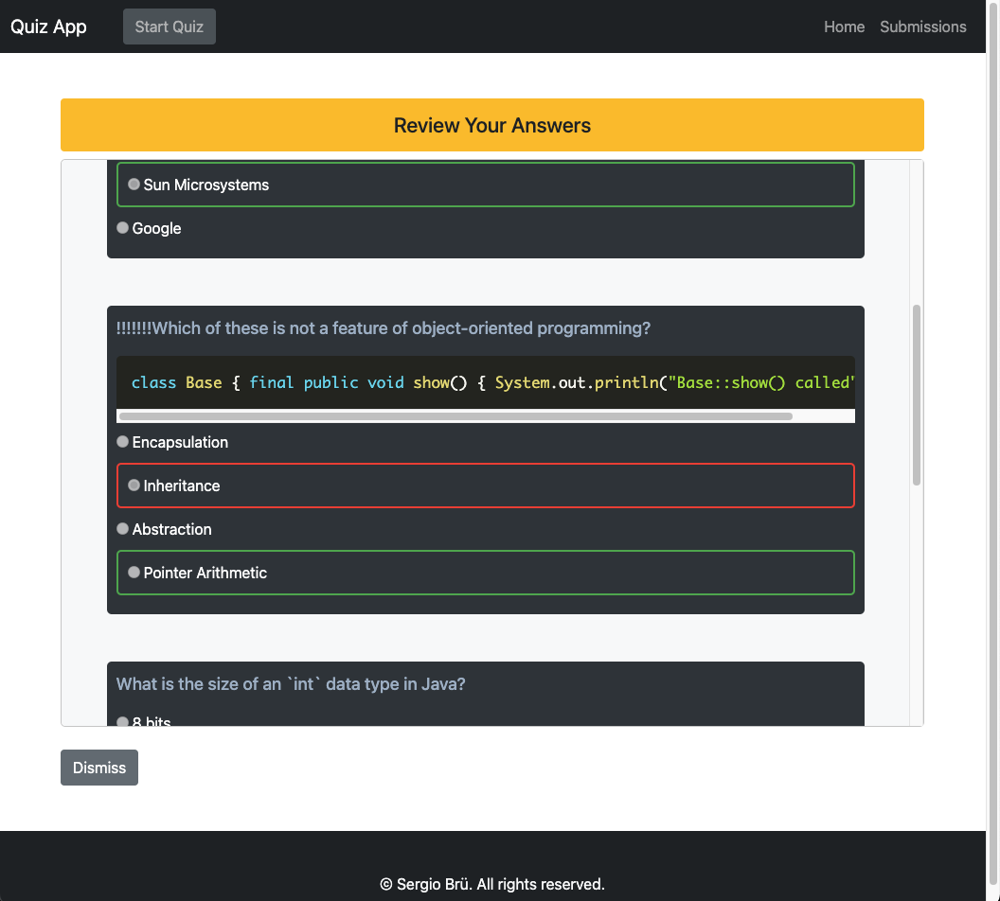
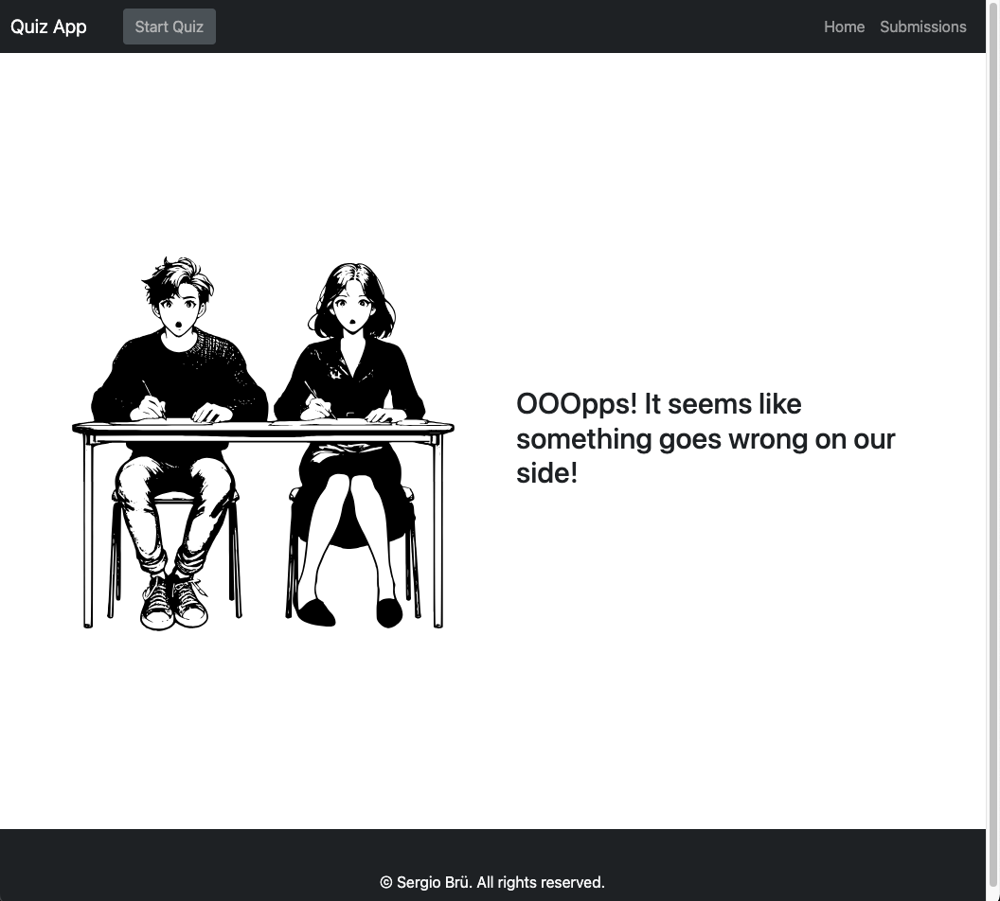

# Quiz App (s09-javaexaminator)
 ## Summary
The application is designed for use both as a standalone Spring Boot MVC application and as part of a microservice module (see the relevant section).
## Features
- **Quiz Taking:** Users can participate in quizzes featuring multiple-choice questions.
- **Answer Submission:** Users can submit their answers for each question in the quiz.
- **Submission Management:** User can view and delete submissions.
- **Answer Highlighting:** Incorrect answers are highlighted, and correct answers along with explanations are displayed.

## Data formats:
The main source of questions is questions.json:
[exam.json](./data/exam.json)


## Getting Started

To get started with the `s09-javaexaminator` module, follow these steps:

### Prerequisites
- Java 11 or higher
- Maven
- Spring Boot

### Installation

1. **Clone the Repository:**
```bash
   git clone https://github.com/zzergAtStage/s09-microservices.git
```

2. **Navigate to the Project Directory:**  
```bash
cd <project-directory>
```
3. ... do something with test errors
4. Run the application
```bash
mvn -f s09-javaexaminator spring-boot:run
```

## Screenshoots
1. Logon screen:

2. Submissions page:

3. Quiz page:

4. Results page:

6. Review page:

6. Review with wrong answer:

7. Error page:

5. 