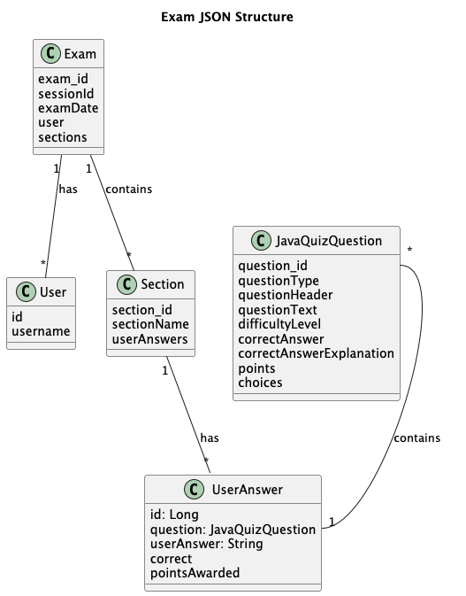
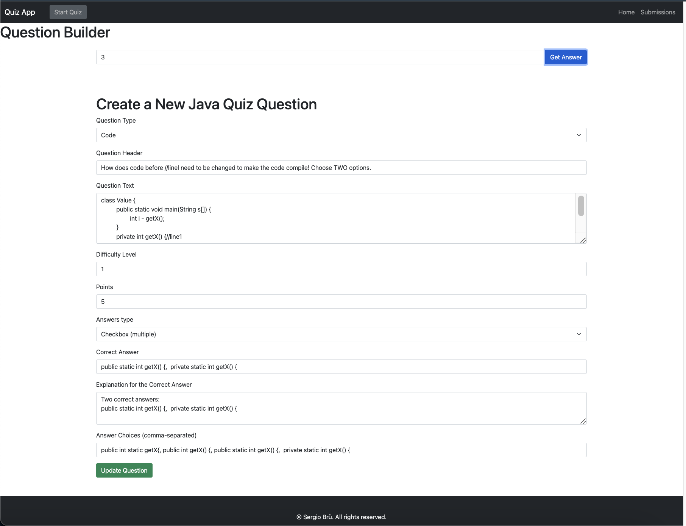
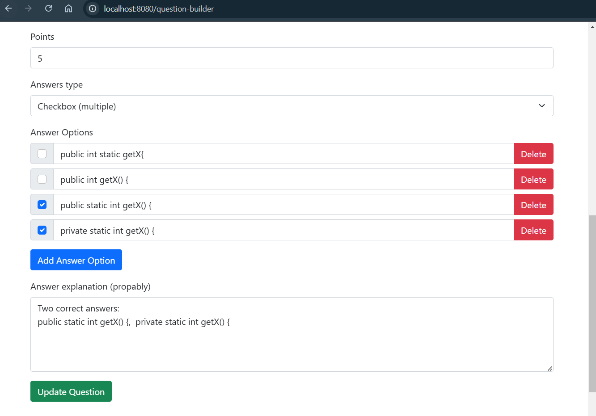

# Quiz App (java-examination)
 ## Summary
The application is designed for use both as a standalone Spring Boot MVC application and as part of a microservice module (see the relevant section).
## Features
- **Quiz Taking:** Users can participate in quizzes featuring multiple-choice questions.
- **Answer Submission:** Users can submit their answers for each question in the quiz.
- **Submission Management:** User can view and delete submissions.
- **Answer Highlighting:** Incorrect answers are highlighted, and correct answers along with explanations are displayed.

## Data formats:
The main source of questions is questions.json:


## Getting Started

To get started with the `java-examinator` module, follow these steps:

### Prerequisites
- Java 17 or higher
- Maven
- Spring Boot

### Installation

1. **Clone the Repository:**
```bash
   git clone https://github.com/zzergAtStage/java-examinator.git
```

2. **Navigate to the Project Directory:**  
```bash
cd <project-directory>
```
3. Build image  
This script will build image to run your app in container:
```bash
./build-scripts/build-images-native.sh
```
4.a run container
```bash  
cd ./build-script/docker/
docker-compose build
docker-compose up -d
```

4.b Run the application locally 
```bash
mvn spring-boot:run
```

5. Use application:  
There are two features to drive the auto import/export:
```properties
#default questions
application.questions.file=exam_.json
application.questions.import.enabled=true #autoimport questions from file
application.questions.export.enabled=false #autoexport questions to file exam_yyyymmddhhmmss.json
```
Use application:

```
http://localhost:8080
```
6. Import your custom exam.json  
Run command:   
```bash
curl --location 'localhost:8080/api/quiz/import' \
--form 'quiz=@"/<your custom data path>/data/exam.json"'
```

## Screenshoots
1. Logon screen:

2. Submissions page:

3. Quiz page:

4. Results page:

5. Review page:

6. Review with wrong answer:

7. Error page:

8. Question builder page (follow the link )  
Lets user edit question, set multi choice answers etc. When you want to keep code - format it well)

 8.1 New version of answer composing:

